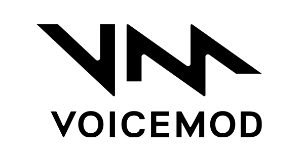

# Voicemod Voice Changer (iOS)

> An extension for Agora

  

  

Voicemod Voice Changer extension brings the power of Voicemod's voice changer technology into any Agora app. With this extension, you can give your users the ability to transform their voice in real time while they stream audio or video.

[Click here for full details](https://www.agora.io/en/agora-extensions-marketplace/voicemod-voice-changer/).

## Installation

Add the URL of this repository to your Xcode 12+ Project.

Go to _File > Swift Packages > Add Package Dependency_, and paste in the link to this repository:

`https://github.com/AgoraIO-Community/Extension-Voicemod-iOS.git`

